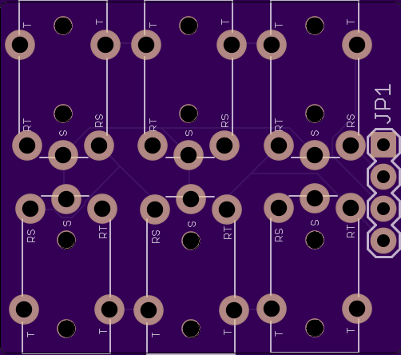
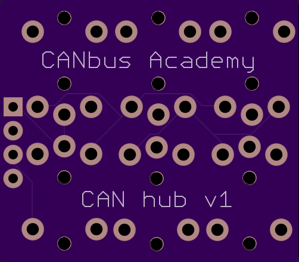

# CAN Adapter

DB9 to 3x [CBA-CAN-TRS](../CBA-CAN-TRS.md) breakout board with switchable termination.

## Purpose

Connects a standard DB9 CAN interface (vehicle, analyzer, or bench setup) to three CBA-CAN-TRS audio jack ports. Plug in up to 3 CAN tools or nodes using cheap 3.5mm stereo cables.

## Specs

- **Size**: 18.7 x 31.8 mm (2-layer)
- **Connectors**: 1x DB9 female, 3x PJ-30220 (3.5mm TRRS jack)
- **Termination**: 60 ohm resistor with solder jumper (RT). 60 ohm provides full bus termination from a single point (equivalent to two 120 ohm resistors in parallel). Use 120 ohm if both ends of the bus are terminated.
- **Breakout header**: JP3 exposes CAN_H, CAN_L, GND for probing or external wiring
- **Passive** — no active components, no power required

## DB9 Pinout

This board uses the **Seeed/education convention**:

| DB9 Pin | Signal |
|---------|--------|
| 3 | CAN_H |
| 5 | CAN_L |
| 2 | GND |

**Warning:** This is NOT the CiA DS102 industry standard used by Microchip, PEAK, and Kvaser analyzers:

| DB9 Pin | CiA DS102 |
|---------|-----------|
| 7 | CAN_H |
| 2 | CAN_L |
| 3 | GND |

Do not cross-connect without verifying pinouts. A crossover cable or re-pinned adapter is needed to interface between the two conventions.

## BOM

| Ref | Part | Value |
|-----|------|-------|
| X1 | DB9 female | — |
| J1, J2, J3 | PJ-30220 | 3.5mm 4-pole audio jack |
| R1 | Resistor (0805) | 60 ohm |
| RT, JP3 | Solder jumper | Termination enable |

## Files

- `db9_trs_adapter.sch` — Eagle schematic
- `db9_trs_adapter.brd` — Eagle board layout
- `gerbers/` — production-ready Gerber files
