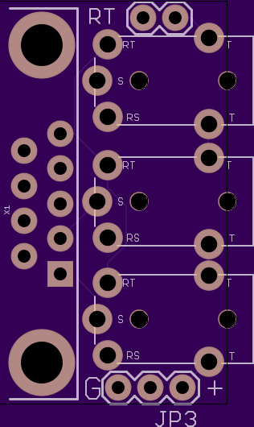

# CAN Hub

6-port [CBA-CAN-TRS](../CBA-CAN-TRS.md) passive CAN bus hub.

## Purpose

Connects up to 6 CAN nodes using 3.5mm stereo cables. All ports are wired in parallel — CAN_H to CAN_H, CAN_L to CAN_L, GND to GND.

Any platform with pin headers (Arduino, ESP32, STM32, Teensy, CANable) can connect directly — solder CAN_H, CAN_L, and GND to a TRS plug and plug into the hub. For DB9 devices, use the [CAN Adapter](../can-adapter/) board.

## Specs

- **Size**: 31.9 x 27.9 mm (2-layer)
- **Connectors**: 6x PJ-30220 (3.5mm TRRS jack)
- **Breakout header**: JP1 exposes all bus signals for probing
- **Passive** — no active components, no power required

## BOM

| Ref | Part | Value |
|-----|------|-------|
| J1–J6 | PJ-30220 | 3.5mm 4-pole audio jack |
| JP1 | Pin header | Bus breakout for probing |

## Files

- `can_hub_v1.sch` — Eagle schematic
- `can_hub_v1.brd` — Eagle board layout
- `gerbers/` — production-ready Gerber files
